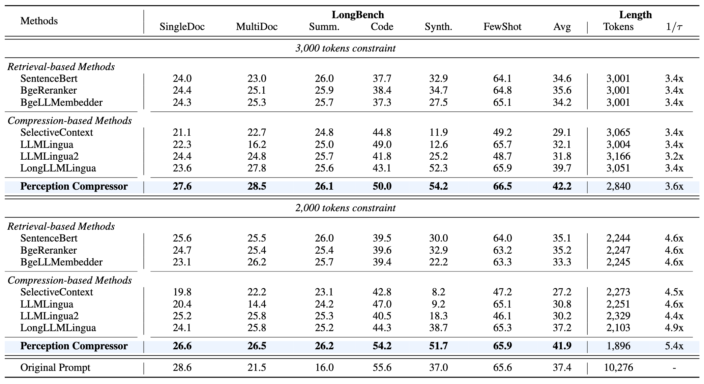

<p align="center">
  <h2 align="center"><strong>Perception Compressor: A Training-Free Prompt Compression Framework in Long Context Scenarios</strong></h2>

<div align="center">

[](https://arxiv.org/abs/2409.19272)

</div>

Code for [Perception Compressor: A Training-Free Prompt Compression Framework in Long Context Scenarios](https://arxiv.org/abs/2409.19272) (NAACL 2025 Findings)<br>
  _Jiwei Tang, Jin Xu, Tingwei Lu, Zhicheng Zhang, Yiming Zhao, Lin Hai, and Hai-Tao Zheng_

## Overview
<p align="center">

</p>

Framework of Perception Compressor. The original prompt can be divided into instruction, demonstrations, and question. Perception Compressor first uses the perception retriever to retrieve the most relevant demonstrations and reorders them from most to least relevant to the input question. Then, it performs a semi-guided iterative compression to obtain the final compressed prompt. The entire process is controlled by the compression ratios and open-book ratios allocated by the dual-slope ratio allocator.

## Main Result
The following tabels present the results of our method compared to baseline methods on NaturalQuestions, LongBench, and MuSiQue. Perception Compressor outperforms all baseline methods by a large margin across all compression constraint ($1/\tau$) settings and different long context tasks, using nearly the fewest input tokens. This highlights the robustness and superiority of the Perception Compressor. Remarkably, even for multi-hop questions, Perception Compressor remains effective. This indicates that when key information is dispersed, the Perception Compressor can still accurately sense the position of different key information and achieve the best performance.

<p align="center">

</p>

<p align="center">

</p>

<p align="center">

</p>

## Usage

We use an example on [NatureQuestions dataset (20 documents)](https://github.com/nelson-liu/lost-in-the-middle/tree/main/qa_data/20_total_documents) to show how to use our codes.

### Relevant LLMs
We use [LLaMA-2-7B](https://huggingface.co/meta-llama/Llama-2-7b-hf) as the LLM for compressing prompt, and calculate the similarity between guiding questions using [SentenceBERT](https://huggingface.co/sentence-transformers/all-mpnet-base-v2). As for the target LLMs, we have used [LongChat-7B-v1.5-32k](https://huggingface.co/lmsys/longchat-7b-v1.5-32k) and [LLaMA-3-8B-Instruct](https://huggingface.co/meta-llama/Meta-Llama-3-8B-Instruct) respectively.

### Runing Perception Compressor on NatureQuestions
- Modify the path in `run_NQ_example.sh` to local weights or folder. Among them, `query_dict_path` refers to the path to the dictionary of input questions and guiding questions on NQ (Natural Questions). This file can be downloaded from [this website](https://pan.baidu.com/s/1T4OKEhp4e8Hw44GIT_gS2g?pwd=zcie). For other datasets, it is necessary to first generate corresponding guiding questions for each input question (by using the prompt: "Please provide n most helpful guiding questions to address the original question: {original question}") and then process them into the appropriate input format.
- Execute `bash run_NQ_example.sh`.

## Citation
If you find this repo helpful, please cite our paper:
```bibtex
@article{tang2024perception,
  title={Perception Compressor: A training-free prompt compression method in long context scenarios},
  author={Tang, Jiwei and Xu, Jin and Lu, Tingwei and Zhang, Zhicheng and Zhao, Yiming and Hai, Lin and Zheng, Hai-Tao},
  journal={arXiv preprint arXiv:2409.19272},
  year={2024}
}
```

## Acknowledgement
We appreciate the following GitHub repos a lot for their valuable code and efforts.
- LLMLingua (https://github.com/microsoft/LLMLingua)
- lost-in-the-middle (https://github.com/nelson-liu/lost-in-the-middle)

## Contact
If you have any questions or want to use the code, feel free to contact:
* Jiwei Tang (tangjw24@mails.tsinghua.edu.cn)